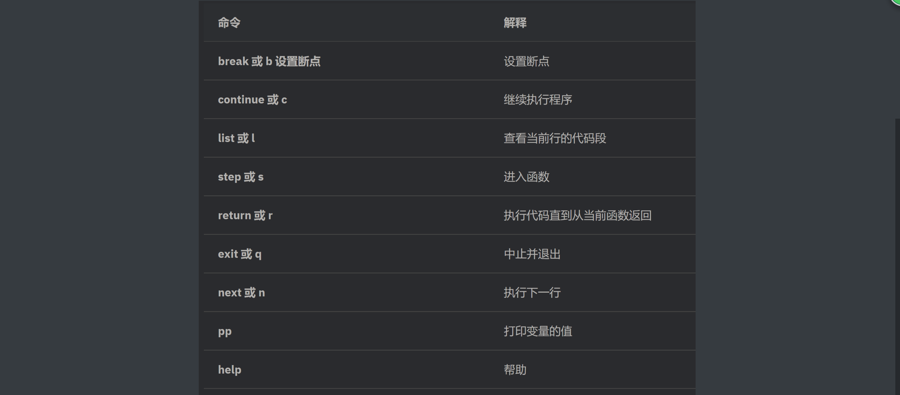
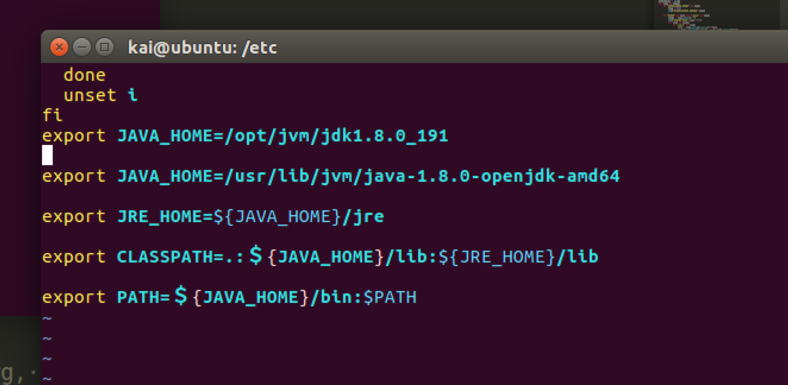
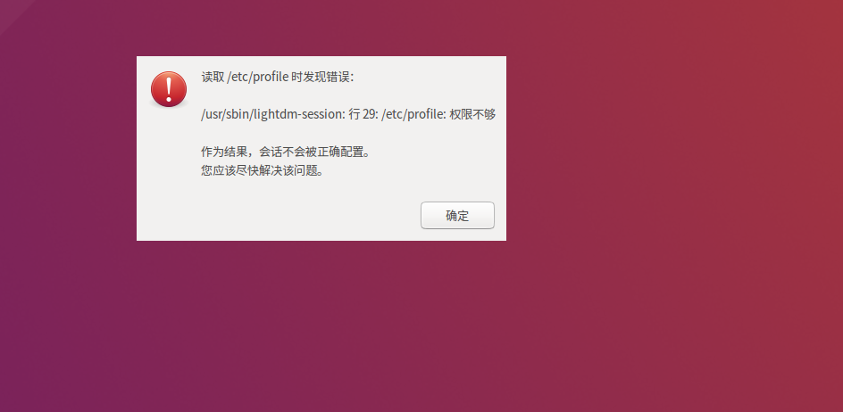
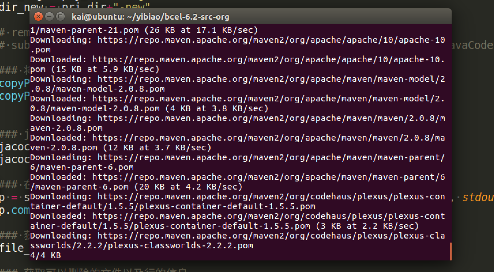
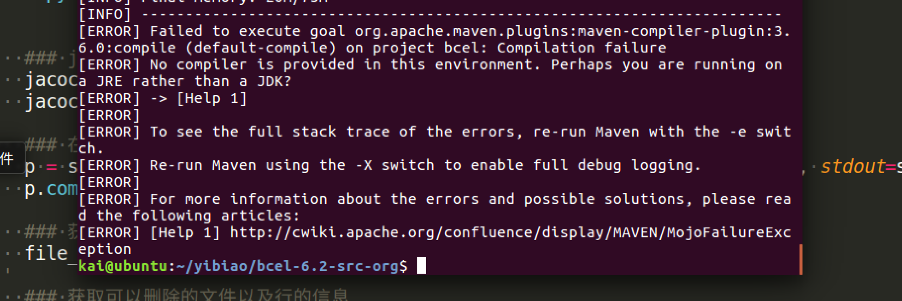
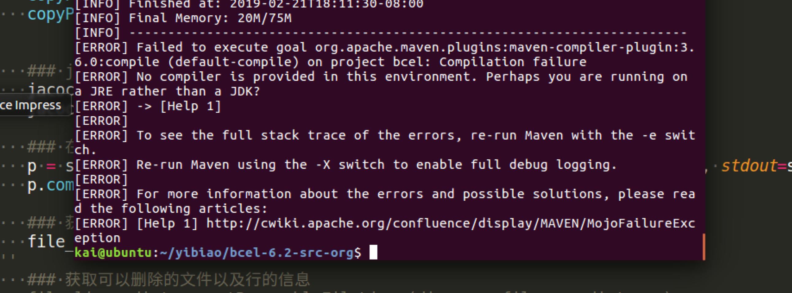
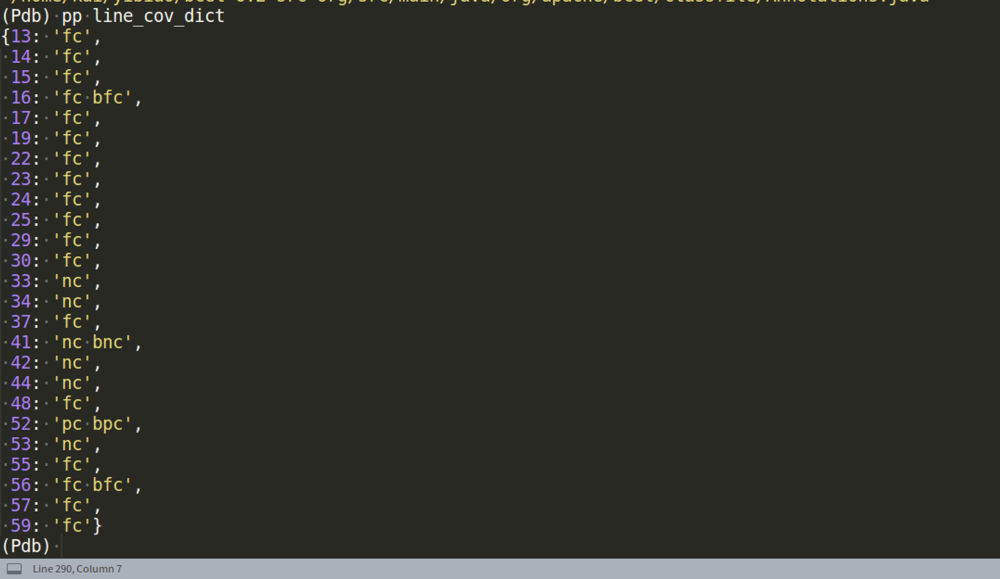

# 大创

[TOC]

###### 图片看不了, 因为是本地方式存的, 在我的电脑上可以看

### 正则表达式输入后清晰展示在做什么的网站[%%%](https://regexper.com/)

## PDB调试

使用 pdb 进行调试
pdb 是 python 自带的一个包，为 python 程序提供了一种交互的源代码调试功能，主要特性包括设置断点、单步调试、进入函数调试、查看当前代码、查看栈片段、动态改变变量的值等。pdb 提供了一些常用的调试命令



## `subprocess.Popen `

```python
subprocess.Popen(args, bufsize=0, executable=None, stdin=None, stdout=None, stderr=None, preexec_fn=None, close_fds=False, shell=False, cwd=None, env=None, universal_newlines=False, startupinfo=None, creationflags=0)
```


> **参数args** `可以是字符串或者序列类型（如：list，元组），用于指定进程的可执行文件及其参数。如果是序列类型，第一个元素通常是可执行文件的路 径。我们也可以显式的使用executeable参数来指定可执行文件的路径。在windows操作系统上，Popen通过调用 CreateProcess()来创建子进程,CreateProcess接收一个字符串参数，如果args是序列类型，系统将会通过 list2cmdline()函数将序列类型转换为字符串。`

> **参数bufsize**：`指定缓冲`

> 参数executable: `用于指定可执行程序。一般情况下我们通过args参数来设置所要运行的程序。如果将参数shell设为 True，executable将指定程序使用的shell。在windows平台下，默认的shell由COMSPEC环境变量来指定。`

> 参数stdin, stdout, stderr `分别表示程序的标准输入、输出、错误句柄。他们可以是PIPE，文件描述符或文件对象，也可以设置为None，表示从父进程继承。`

> 参数preexec_fn `只在Unix平台下有效，用于指定一个可执行对象（callable object），它将在子进程运行之前被调用。`

> 参数Close_sfs： `在windows平台下，如果close_fds被设置为True，则新创建的子进程将不会继承父进程的输入、输出、错误管 道。我们不能将close_fds设置为True同时重定向子进程的标准输入、输出与错误(stdin, stdout, stderr)。`

> 参数shell `设为true，程序将通过shell来执行。`

> 参数cwd `用于设置子进程的当前目录。`

> 参数env `字典类型，用于指定子进程的环境变量。如果env = None，子进程的环境变量将从父进程中继承。`

> 参数Universal_newlines: `不同操作系统下，文本的换行符是不一样的。如：windows下用’/r/n’表示换，而Linux下用 ‘/n’。如果将此参数设置为True，Python统一把这些换行符当作’/n’来处理。`

> 参数startupinfo与createionflags `只在windows下用效，它们将被传递给底层的CreateProcess()函数，用 于设置子进程的一些属性，如：主窗口的外观，进程的优先级等等。`

**有用到的: **

> 参数cwd `用于设置子进程的当前目录。`

> 参数shell `设为true，程序将通过shell来执行。`

>**subprocess.PIPE**
>在创建Popen对象时，subprocess.PIPE可以初始化stdin, stdout或stderr参数。**表示与子进程通信的标准流。**

## `p.communicate()`

使用 `subprocess` 模块的 `Popen` 调用外部程序，如果 `stdout` 或 `stderr` 参数是 pipe，并且程序输出超过操作系统的 pipe size时，如果使用 `Popen.wait()` 方式等待程序结束获取返回值，会[导致死锁](http://docs.python.org/release/2.7.3/library/subprocess.html#subprocess.Popen.wait)，程序卡在 `wait()` 调用上。

官方文档里推荐使用` Popen.communicate()`。这个方法会把输出放在内存，而不是管道里，所以这时候上限就和内存大小有关了，一般不会有问题。而且如果要获得程序返回值，可以在调用 `Popen.communicate() `之后取` Popen.returncode` 的值。

结论：如果使用 `subprocess.Popen`，就不使用 `Popen.wait()`，而使用` Popen.communicate() `来等待外部程序执行结束。

`Popen. communicate`(*input=None*)[¶](http://docs.python.org/2/library/subprocess.html#subprocess.Popen.communicate)

## profile 文件只读

`sudo chmod 700 /etc/profile`

## JAVA_HOME environment variable is not set.

JAVA_HOME 第一行是之前的, 第二行是更改的



下面是 蜜汁 dollar 大写错误..... /xk /xk /xk


各种目录找到疯了...

`/usr/lib/jvm/java-8-openjdk-amd64/jre`

`/usr/lib/jvm`

`sudo vi /root/.bashrc`

`sudo vim /etc/profile`

## sudo: source：找不到命令

切换到root用户, 用 `sudo su` 解决

`sudo su`环境用的是目标用户(root)的环境

`sudo -s `环境用的是当前用户本身的环境



不要盲目去谷歌百度搜索, 看提示知道自己是什么问题, 对症下药.

最后抓住是` /etc 和 /etc/profile `的权限问题, 改了权限就解决了.

## 查看文件的权限[***](https://www.cnblogs.com/sxdcgaq8080/p/7498906.html)

  我们来**查看一下zhaoyuqiang.html**这个网页文件的权限。

方法：在终端输入:
**ls -l xxx.xxx （xxx.xxx是文件名）**查看的是xxx文件之中的文件权限

那么就会出现相类似的信息，主要都是这些：-rw-rw-r--

[](http://img1.51cto.com/attachment/201306/113244575.png)

 一共有十位数，其中：最前面那个 - 代表的是类型

**中间那三个 rw- 代表的是所有者（user）拥有的权限**
**然后那三个 r-- 代表的是组群（group）拥有的权限**
**最后那三个 r-- 代表的是其他人（other）拥有的权限**

**需要注意的是**：查看文件权限的目录问题: **如果有文件夹  /a/b/c**
那么执行 ls -l /a/b 查看权限的文件并不是b，而是查看的c的权限。

ls -l /a 查看的是b文件的权限

ls -l /a/b 查看的是c文件的权限

ls -l /a/b/c 查看的是c文件的权限

```
-rw------- (600) 只有所有者才有读和写的权限

-rw-r--r-- (644) 只有所有者才有读和写的权限，组群和其他人只有读的权限

-rwx------ (700) 只有所有者才有读，写，执行的权限

-rwxr-xr-x (755) 只有所有者才有读，写，执行的权限，组群和其他人只有读和执行的权限

-rwx--x--x (711) 只有所有者才有读，写，执行的权限，组群和其他人只有执行的权限

-rw-rw-rw- (666) 每个人都有读写的权限

-rwxrwxrwx (777) 每个人都有读写和执行的权限
```

 

### Linux文件和目录访问权限设置[***](https://www.cnblogs.com/sxdcgaq8080/p/7498906.html)

使用chmod和数字改变文件或目录的访问权限
      文件和目录的权限表示，是用rwx这三个字符来代表所有者、用户组和其他用户的权限。有时候，字符似乎过于麻烦，因此还有另外一种方法是**以数字来表示权限**，而且仅需三个数字。
r: 对应数值4
w: 对应数值2
x：对应数值1
－：对应数值0
数字设定的关键是mode的取值，一开始许多初学者会被搞糊涂，其实很简单。

**（一） 我们将rwx看成二进制数，如果有则有1表示，没有则有0表示，那么rwx r-x r- -则可以表示成为：111 101 100再将其每三位转换成为一个十进制数，就是754。**

**（二） 也可以将其简单的理解为一种运算: (4+2+1) (4+1) (4)=754**
**例如，**我们想让zhaoyuqiang.html这个文件的权限为：
           自己     同组用户     其他用户
可读      是            是              是
可写      是              是 
可执行  是
**那么，我们先根据上表得到权限串为：rw-rw-r--，那么转换成二进制数就是110 110 100，再每三位转换成为一个十进制数，就得到664，因此我们执行命令：**

[](http://img1.51cto.com/attachment/201306/113257331.png)

根据上图可以看出对zhaoyuqiang.html执行664后，它的权限变成了

​         -  rw-（自己）  rw- （同组用户） r--（其它用户）**

 按照上面的规则，rwx合起来就是4 2 1＝7，一个rwxrwxrwx权限全开放的文件，数值表示为777；而完全不开放权限的文件“－－－－－－－－－”其数字表示为000。下面举几个例子：-rwx------:等于数字表示700。-rwxr—r--:等于数字表示744。-rw-rw-r-x:等于数字表示665。drwx—x—x:等于数字表示711。drwx------:等于数字表示700。

 

## 查找文件

`which` 查看可执行文件的位置,从全局环境变量PATH里面查找对应的路径,默认是找 bash内所规范的目录

`whereis `查看文件的位置,配合参数-b，用于程序名的搜索，从`linux`数据库查找。

`locate` 配合数据库查看文件位置。

```
find -name april*                     在当前目录下查找以april开始的文件
find -name april* fprint file        在当前目录下查找以april开始的文件，并把结果输出到file中
find -name ap* -o -name may*   查找以ap或may开头的文件
find /mnt -name tom.txt   -ftype vfat   在/mnt下查找名称为tom.txt且文件系统类型为vfat的文件
find /mnt -name t.txt ! -ftype vfat   在/mnt下查找名称为tom.txt且文件系统类型不为vfat的文件
find /tmp -name wa* -type l            在/tmp下查找名为wa开头且类型为符号链接的文件
find /home -mtime   -2                 在/home下查最近两天内改动过的文件
find /home -atime -1                  查1天之内被存取过的文件
find /home -mmin    +60                  在/home下查60分钟前改动过的文件
find /home -amin   +30                  查最近30分钟前被存取过的文件
find /home -newer   tmp.txt             在/home下查更新时间比tmp.txt近的文件或目录
find /home -anewer   tmp.txt            在/home下查存取时间比tmp.txt近的文件或目录
```

### Understanding a little more about /etc/profile and /etc/bashrc[***](https://bencane.com/2013/09/16/understanding-a-little-more-about-etcprofile-and-etcbashrc/)


## 具体流程

### 1. mvn clean compile ( 在 dir_org: /home/kai/yibiao/bcel-6.2-src-org/target/jacoco-ut 路径下 )





### 2. mvn clean test




### 一. 获取项目的覆盖信息

#### 3. getCoverageInformation()


找到以 `'<span class='` 开头的行

**然后:**

#### 4.`ci = re.findall('<span class="([\w|\s]+)" id="L(\d+)"', line)`

读取 `span class` 后面的东西
比如: `'<span class="fc" id="L13">\t\tthis(annotation_type, name_index, length, (AnnotationEntry[]) null, constant_pool, isRuntimeVisible);</span>\n'` **经过上面的语句之后, 就是`ci`里面提取了, `fc, 13`**

-----------

##### 正则表达式 `re.findall` 用法

正则 `re.findall ` 的简单用法（返回`string`中所有与`pattern`相匹配的全部字串，返回形式为数组）
语法：

`findall(pattern, string, flags=0)`

```python
# "w" 在正则里面代表匹配从小写a到z, 大写A到Z, 数字0到9
regular_v8 = re.findall(r"\w","https://docs.python.org/3/whatsnew/3.6.html")
print(regular_v8)
# ['h', 't', 't', 'p', 's', 'd', 'o', 'c', 's', 'p', 'y', 't', 'h', 'o', 'n', 'o', 'r', 'g', '3', 'w', 'h', 'a', 't', 's', 'n', 'e', 'w', '3', '6', 'h', 't', 'm', 'l']
```

```python
# "d"是正则语法规则用来匹配0到9之间的数返回列表
regular_v5 = re.findall(r"\d","https://docs.python.org/3/whatsnew/3.6.html")
regular_v6 = re.findall(r"\d\d\d","https://docs.python.org/3/whatsnew/3.6.html/1234")
print(regular_v5)
# ['3', '3', '6']
print(regular_v6)
# ['123']
```

--------------------------


#### 5.循环读取所有的<span开头的, 记录在`line_cov_dict[]`

**两次循环:**

 

**循环结束后:**




#### 6.大循环后, 记录在 `file_cov_dict[]` 里面, 返回

```python
# 
file_org = getSourceFileName(covFile)
file_cov_dict[file_org] = line_cov_dict
```

`file_cov_dict[]` 里面记录着每个文件里的信息: 


### 二. 获取可删除的文件和行号的信息

```python
''' 获取可删除的文件和行号的信息 '''
def getRemovableFileLines(dir_org, file_cov_dict):
    keys = set()
    file_lines_dict = {}
    # 遍历刚刚读取的文件信息
    # file_org 刚刚读取的文件绝对路径
    for file_org, line_cov_dict in file_cov_dict.items():
        keys |= set(line_cov_dict.values())		# 不断取并集, 集合有去重
	
    	# 判断是不是文件, 预防错误
        if not os.path.isfile(file_org):
            LOG("[Error] Can not find orignal java source file: "+file_org+" for coverage file: "+covFile)

        text_org = None
        with open(file_org, "r") as fr:
            text_org = fr.readlines()

        lines = set()
	    # 遍历信息
        for lnum, lcov in line_cov_dict.items():
            # 几个判断条件
            if not lcov.startswith("nc"):
                continue

            if lnum <= 2:
                continue

            if lnum >= len(text_org):
                LOG("[ERROR] line number "+lnum+" is larger than length of file: "+file_org)
                continue
		   
        	# 截取靠近的两行, 然后下面进到 isCodeLineRemovable() 就是这两行
            line_curr = text_org[lnum-1]
            line_prev = text_org[lnum-2]
			
            # 可删, 删除解释见下文
            if isCodeLineRemovable(line_curr, line_prev):
                lines.add(lnum)

        if len(lines) >= 1:
            file_lines_dict[file_org] = sorted(lines)		# 从小到大排序

    LOG("[ALL-KEYS]"+','.join(keys)+"\n")				   # 记录所有覆盖信息
    # 返回 file_lines_dict[file_org] = lines: file_org(路径), lines(此文件删除的行号(从小到大))
    return file_lines_dict

```

-----------------------------------

#### 判断代码行可不可以删除函数`isCodeLineRemovable(text_curr, text_prev)`:

```python
''' 判断代码行是否可以删除 ''' ''' TODO 修改这个函数************ '''
def isCodeLineRemovable(text_curr, text_prev):
    # 删除所有注释
    # 下面就是做了 1. 删除text_curr, text_prev里的 '//...'; 2. 删除 '/*...*/'
    reg1 = re.compile('\/\*.*\*\/',re.M|re.DOTALL) # 匹配 /* ... */ 正则里面 .* 就是any character
    reg2 = re.compile('\/\/.*', re.M|re.DOTALL)	   # 匹配 // ...
    
    text_curr = reg1.sub('', text_curr)
    text_prev = reg1.sub('', text_prev)

    text_curr = reg2.sub('', text_curr)
    text_prev = reg2.sub('', text_prev)

    text_curr = text_curr.strip()	# 去除首尾空格
    text_prev = text_prev.strip()

    # 如果一行都是注释, 处理之后text_curr, text_prev就都是空了.
    if text_curr.endswith(';') or text_curr.endswith('{'):
        if text_prev.startswith('//') or text_prev.endswith('*/') or text_prev=='': ### 上一行是注释或者空行
            return True
        if text_prev.endswith(';') or text_prev.endswith('{') or text_prev.endswith('}') or text_prev.endswith(':'): ### 上一行以 ';' 或 '{' 或 '}' 或 ':' 结尾
            return True

    return False
```

----------------------------------------

##### 正则表达式 `re.compile()`

`compile()`的**定义：**

```python
compile(pattern, flags=0) 
Compile a regular expression pattern, returning a pattern object.
```

从compile()函数的定义中，可以看出返回的是一个匹配对象，它单独使用就没有任何意义，需要和findall(), search(), match(）搭配使用。 
compile()与findall()一起使用，返回一个列表。

```python
import re


def main():
    content = 'Hello, I am Jerry, from Chongqing, a montain city, nice to meet you……'
    regex = re.compile('\w*o\w*')
    x = regex.findall(content)
    print(x)

if __name__ == '__main__':
    main()
# ['Hello', 'from', 'Chongqing', 'montain', 'to', 'you']

```

---------------------------------------

### 三. 开始删
#### 7. 现在获取完可以删除的文件以及行的信息了

```python
# 记录: Try to removing lines from the files: 文件里的所有覆盖信息? 以'\n'间隔
LOG("Try to removing lines from the files: "+"\n"+'\n'.join(file_lines_dict.keys())+'\n\n')
	# 遍历, 按照 key = 
    for file_org in sorted(file_lines_dict, key=lambda k:len(file_lines_dict[k]), reverse=True):
        if file_org!='/root/yibiao/bcel-6.2-src-org/src/main/java/org/apache/bcel/generic/AALOAD.java':
            continue  
        LOG('\n\n\n==========================================================\n')
        LOG(file_org+'\n')
        LOG('==========================================================\n')

        lines = file_lines_dict[file_org]				# 获取 file_org 文件要删除的行号
        file_new = file_org.replace(dir_org, dir_new)	 # 得到 file_new 的路径( 从file_org下 )
        
        # 记录: Remove unexecuted lines 1, 2, 3, 4... from (路径) \n
        LOG("Remove unexecuted lines "+','.join(str(i) for i in lines)+" from "+file_new+'\n')
        
        # 删
        removeCodeLinesFromSourceFile(file_org, lines, file_new)
        
        p = subprocess.Popen('mvn clean compile', cwd=dir_new, stdout=subprocess.PIPE, stderr=subprocess.PIPE, shell=True)
        stdout, stderr = p.communicate()
        (flag, _) = hasCompilationError(stdout)		# 判断删完是不是编译错误
    
        if flag:
            LOG("[mvn compile] Failed with COMPILATION ERROR when removing unexecuted lines from "+file_new+"\n")
            restoreFileContent(file_org, file_new)	# 从之前的复原
        else:
            LOG("[mvn compile] Success when removing unexecuted lines from "+file_new+'\n')

            p = subprocess.Popen('mvn clean test', cwd=dir_new, stdout=subprocess.PIPE, stderr=subprocess.PIPE, shell=True)
            stdout, stderr = p.communicate()
			
            # 判断删完是不是BUILD错误
            if hasTestingError(stdout):
                LOG("[mvn test] Failed with BUILD FAILURE when removing unexecuted lines from "+file_new+"\n")
            else:
                LOG("[mvn test] Success when removing unexecuted lines from "+file_new+"\n")
                
                ### 获取jacoco new目录下的文件覆盖信息，返回的是file, line_cov的键值对
                if os.path.exists(jacoco_folder_new):
                    file_cov_dict_new = getCoverageInformation(jacoco_folder_new)

                    ### TODO compare two dictionary
                    flag = diffCoverage(file_cov_dict_org, file_cov_dict_new, dir_org, dir_new)

                    if flag:
                        # 成功了
                        LOG("[INCONSISTENT!!!] when removing unexecuted lines from "+file_new+"\n")
                        break
                    else:
                        LOG("[CONSISTENT] when removing unexecuted lines from "+file_new+"\n")
                        continue
                else:
                    pdb.set_trace()
                    LOG("JACOCO folder for "+jacoco_folder_new+" not exists\n")
```

-----------------------------------

##### file_new中对应的未执行的代码行删掉函数`removeCodeLinesFromSourceFile(file_org, lines, file_new)`

```python
def removeCodeLinesFromSourceFile(file_org, lines, file_new):
    # 读取文件
    with open(file_org, "r") as fr:
        text = fr.readlines()

        for lnum in lines:
            line = text[lnum - 1]

            if line.startswith('public'):
                continue
                
            # DEL_POSITION 1
            if ':' in line:
                # 判断该行代码是否以 label : statement 这种形式出现
                # 就是在行开始时是不是 word/digit + ':'出现
                ret = re.match(r'^[\w|\d]+\s*:', line.strip())
                if not ret is None:
                    items = line.split(':', 1)		# 以 ':' 分割成两部分
                    
                    # 如果 ':' 后面字段(items[1]) 是以 'for', 'if' 开头:
                    # 就在 ':' 前面字段(items[0]) 后加上' : if (false) {/* UNEXE */ //'
                    # 然后存到 text[lnum - 1]
                    if items[1].strip().startswith('for') or items[1].strip().startswith('if'):
                        text[lnum - 1] = items[0] + \
                            ' : if (false) {' + '/* UNEXE */ //' + line
                    else:
                        text[lnum - 1] = items[0] + \
                            ' : ; ' + '/* UNEXE */ //' + line
                    continue		# 直接下一个for循环

                    
            if line.strip().startswith('try'):  # 该行是try 语句，则保留
                # text[lnum-1] = 'try (false) { '+'/* UNEXE */ //'+line
                continue
                
            elif line.strip().startswith('switch'):  # 该行是switch语句则变成switch(0)
                text[lnum - 1] = 'switch (0) { ' + '/* UNEXE */ //' + line
                
            elif line.strip().startswith('if') or line.strip().startswith('for'):  # 该行是if / for语句，则
                text[lnum - 1] = 'if (false) { ' + '/* UNEXE */ //' + line
                
            elif line.strip() == '} else {' or line.strip() == 'return;':
                continue
                
            elif line.strip().startswith('} catch'):
                text[lnum - 1] = '} catch (Exception e) { /* UNEXE */ //' + line
                
            elif line.strip().endswith('{'):
                text[lnum - 1] = '{ /* UNEXE */ //' + line
                
            elif line.strip().startswith('return'):
                text[lnum - 1] = 'return null; /* UNEXE */ //' + line
            # 其他都删
            else:
                text[lnum - 1] = '/* UNEXE */ //' + line
                

        with open(file_new, "w") as fw:
            fw.writelines(text)

```


## 判断标准

```python
###### 不删:

# getRemovableFileLines(dir_org, file_cov_dict):
if not lcov.startswith("nc"):
    continue
if lnum <= 2:
    continue
if lnum >= len(text_org):
	LOG("[ERROR] line number "+lnum+" is larger than length of file: "+file_org)
    continue
    
# 这个是删除未执行的代码的
# removeCodeLinesFromSourceFile(file_org, lines, file_new):
if line.startswith('public'):
    continue
if line.strip().startswith('try'):  # 该行是try 语句，则保留
	continue
    
###### 删:

# def isCodeLineRemovable(text_curr, text_prev):
# 1. 上一行是注释或者空行
# 2. 上一行以 ';' 或 '{' 或 '}' 或 ':' 结尾

# removeCodeLinesFromSourceFile(file_org, lines, file_new):
# 详见 # DEL_POSITION 1
# 如果 ':' 后面字段(items[1]) 是以 'for', 'if' 开头:
# 就在 ':' 前面字段(items[0]) 后加上' : if (false) {/* UNEXE */ //'
# 然后存到 text[lnum - 1]

elif line.strip().startswith('switch') : # 该行是switch语句则变成switch(0)
text[lnum - 1] = 'switch (0) { ' + '/* UNEXE */ //' + line

elif line.strip().startswith('if') or line.strip().startswith('for') : # 该行是if / for语句，则
text[lnum - 1] = 'if (false) { ' + '/* UNEXE */ //' + line

elif line.strip() == '} else {' or line.strip() == 'return;':
continue

elif line.strip().startswith('} catch') :
text[lnum - 1] = '} catch (Exception e) { /* UNEXE */ //' + line

elif line.strip().endswith('{') :
text[lnum - 1] = '{ /* UNEXE */ //' + line

elif line.strip().startswith('return') :
text[lnum - 1] = 'return null; /* UNEXE */ //' + line
```


## Python

### Python正则表达式里的单行re.S和多行re.M模式 [%%%](https://www.cnblogs.com/pugang/p/10123285.html)

 Python 的re模块内置函数几乎都有一个flags参数，以位运算的方式将多个标志位相加。其中有两个模式：单行（re.DOTALL, 或者re.S）和多行（re.MULTILINE, 或者re.M）模式。它们初看上去不好理解，但是有时又会非常有用。

**单行模式 re.DOTALL**

在单行模式里，文本被强制当作单行来匹配，什么样的文本不会被当作单行？就是里面包含有换行符的文本，比如：

This is the first line.\nThis is the second line.\nThis is the third line.

点号（.）能匹配所有字符，换行符例外。现在我们希望能匹配出整个字符串，当用点号（.）匹配上面这个字符串时，在换行符的地方，匹配停止.

更本质的说法是, 多行模式改变了^和$的匹配行为

### `with as` 语法

```python
# With语句是什么？
#有一些任务，可能事先需要设置，事后做清理工作。对于这种场景，Python的with语句提供了一种非常方便的处理方式。一个很好的例子是文件处理，你需要获取一个文件句柄，从文件中读取数据，然后关闭文件句柄。
# 如果不用with语句，代码如下：
file = open("/tmp/foo.txt")
data = file.read()
file.close()

# 这里有两个问题。一是可能忘记关闭文件句柄；二是文件读取数据发生异常，没有进行任何处理。下面是处理异常的加强版本：
file = open("/tmp/foo.txt")
try:
    data = file.read()
finally:
    file.close()

# 虽然这段代码运行良好，但是太冗长了。这时候就是with一展身手的时候了。除了有更优雅的语法，with还可以很好的处理上下文环境产生的异常。下面是with版本的代码：
with open("/tmp/foo.txt") as file:
    data = file.read()
```


### Python `iter() `函数

------

#### 描述

**iter()** 函数用来生成迭代器。
以下是 iter() 方法的语法:

```
iter(object[, sentinel])
```
#### 参数

- object -- 支持迭代的集合对象。
- sentinel -- 如果传递了第二个参数，则参数 object 必须是一个可调用的对象（如，函数），此时，iter 创建了一个迭代器对象，每次调用这个迭代器对象的__next__()方法时，都会调用 object。
- 打开模式

#### 返回值

迭代器对象。

#### 实例

`>>> lst = [1, 2, 3] ``
``>>> for i in iter(lst): ...     print(i)`


### `os.path.isfile()`

`os.path.isfile()`用于判断某一对象(需提供绝对路径)是否为文件

```python
import os
dirct = '/home/workespace/notebook/'
for i in os.listdir(dirct):
    fulldirct = os.path.join(dirct, i)
    if os.path.isfile(fulldirct): # 入参需要是绝对路径
        print(i)
        
# study_test.ipynb
# Untitled.ipynb
```


### `join()`函数

语法： ` 's'.join(t)`

```
参数说明
s：分隔符。可以为空
t：要连接的元素序列、字符串、元组、字典
上面的语法即：以s作为分隔符，将t所有的元素合并成一个新的字符串

返回值：返回一个以分隔符s连接各个元素后生成的字符串
```


### `split()`函数

```python
str.split(str="", num=string.count(str)).
```

#### 参数

- str -- 分隔符，默认为所有的空字符，包括空格、换行(\n)、制表符(\t)等。
- num -- 分割次数。默认为 -1, 即分隔所有。

#### 返回值

返回分割后的字符串列表。

#### 实例(Python 2.0+)

```python
str = "Line1-abcdef \nLine2-abc \nLine4-abcd"; 
print str.split( );       # 以空格为分隔符，包含 \n    
print str.split(' ', 1 ); # 以空格为分隔符，分隔成两个
```

以上实例输出结果如下：

```python
['Line1-abcdef', 'Line2-abc', 'Line4-abcd']
['Line1-abcdef', '\nLine2-abc \nLine4-abcd']
```


### `strip()`函数

```
str.strip([chars]);
```

#### 参数

- chars -- 移除字符串头尾指定的字符序列。

#### 返回值

返回移除字符串头尾指定的字符生成的新字符串。

#### 实例(Python 2.0+)

```python
#!/usr/bin/python
# -*- coding: UTF-8 -*-
 
str = "00000003210Runoob01230000000"; 
print str.strip( '0' );  # 去除首尾字符 0
 
 
str2 = "   Runoob      ";   # 去除首尾空格
print str2.strip();
```

以上实例输出结果如下：

```
3210Runoob0123
Runoob
```