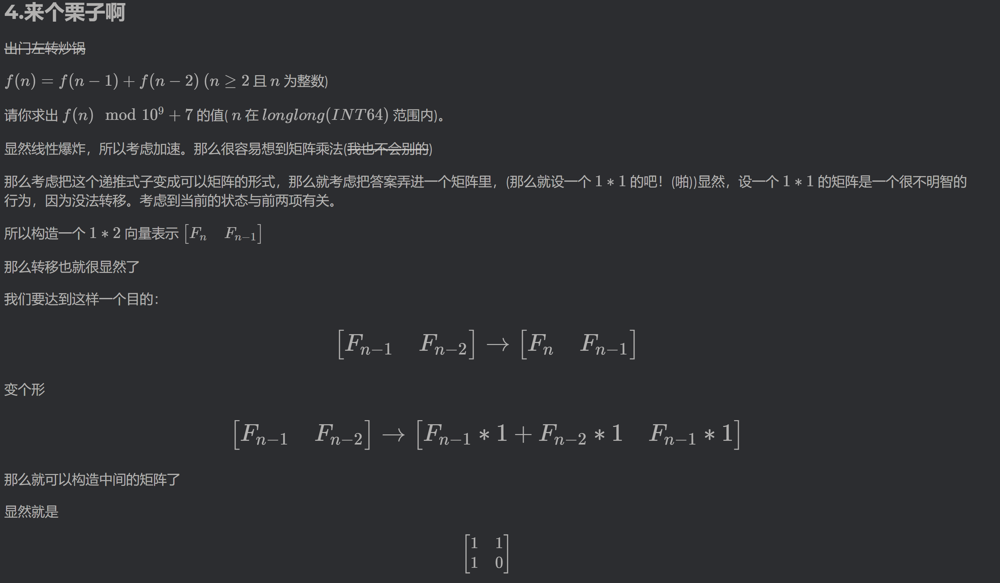
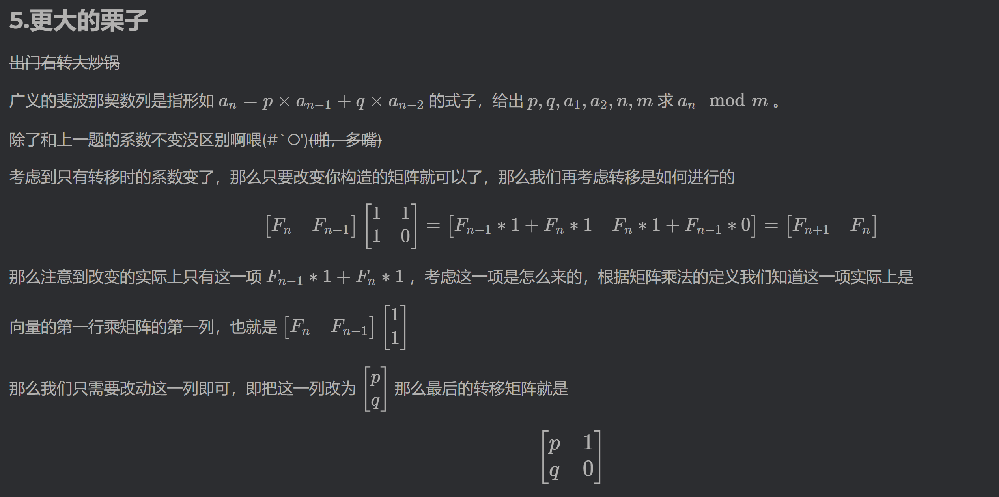

# OJ2

[TOC]

## 零碎知识点

1. 有那种一大堆求和的, 还是区间端点不确定的, 去算前缀和.

## CDQ分治

### 基本思想

　　CDQ分治的基本思想十分简单。如下：

1. 我们要解决一系列问题，这些问题一般包含修改和查询操作，可以把这些问题排成一个序列，用一个区间[L,R]表示。
2. 分。递归处理左边区间[L,M]和右边区间[M+1,R]的问题。
3. 治。合并两个子问题，同时考虑到[L,M]内的修改对[M+1,R]内的查询产生的影响。即，用左边的子问题帮助解决右边的子问题。

### 具体实现和用途

   　　**二维偏序问题**

给定**N**个有序对**(a,b)**，求对于每个***(a,b)**，满足**a2<a**且**b2<b**的有序对**(a2,b2)**有多少个。**

我们**从归并排序求逆序对**来引入二维偏序问题。

回忆一下归并排序求逆序对的过程，我们在合并两个子区间的时候，**要考虑到左边区间的对右边区间的影响**。即，我们每次从右边区间的有序序列中取出一个元素的时候，要把**“以这个元素结尾的逆序对的个数”加上“左边区间有多少个元素比他大”**。这是一个典型的CDQ分治的过程。

**求逆序对**就是一个二维偏序问题

现在我们把这个问题拓展到二维偏序问题。在归并排序求逆序对的过程中，每个元素可以用一个有序对(a,b)表示，其中a表示数组中的位置，b表示该位置对应的值。我们求的就是“对于每个有序对(a,b)，有多少个有序对(a2,b2)满足a2<a且b2>b”，这就是一个二维偏序问题。

注意到在求逆序对的问题中，**a元素是默认有序的，**即我们拿到元素的时候，数组中的元素是默认从第一个到最后一个按顺序排列的，**所以我们才能在合并子问题的时候忽略a元素带来的影响**。

*因为我们在合并两个子问题的过程中，左边区间的元素一定出现在右边区间的元素之前，即左边区间的元素的a都小于右边区间元素的a。*

考虑二维偏序问题的另一种解法，**用树状数组**代替CDQ分治，即常用的用树状数组求顺序对。在按照a元素排序之后，我们对于整个序列从左到右扫描，每次扫描到一个有序对，求出“扫描过的有序对中，有多少个有序对的b值小于当前b值”，可以用 权值树状数组/权值线段树 实现。然而当b的值非常大的时候，空间和时间上就会吃不消，便可以用CDQ分治代替，就是我们所说的“顶替复杂的高级数据结构”。别急，一会儿我们会看到CDQ分治在这方面更大的用途。

### 二维偏序问题的拓展

   　　**给定一个**N**个元素的序列**a**，初始值全部为**0**，对这个序列进行以下两种操作：**

   　　**操作**1**：格式为**1 x k**，把位置**x**的元素加上**k**（位置从**1**标号到**N**）。**

   　　**操作**2**：格式为**2 x y**，求出区间**[x,y]**内所有元素的和。**

   　　这是一个经典的树状数组问题，可以毫无压力地秒掉，**现在，我们用CDQ分治解决它——带修改和查询的问题。**

   　　我们把他转化成一个二维偏序问题，每个操作用一个有序对(a,b)表示，其中a表示操作到来的时间，b表示操作的位置，时间是默认有序的，所以我们在合并子问题的过程中，就按照b从小到大的顺序合并。

   　　问题来了：如何表示修改与查询？

   　　具体细节请参见代码，这里对代码做一些解释，请配合代码来看。我们定义结构体Query包含3个元素：type，idx，val，其中idx表示操作的位置，type为1表示修改，val表示“加上的值”。而对于查询，我们用前缀和的思想把他分解成两个操作：sum[1,y]-sum[1,x-1]，即分解成两次前缀和的查询。在合并的过程中，type为2表示遇到了一个查询的左端点x-1，需要把该查询的结果减去当前“加上的值的前缀和”，type为3表示遇到了一个查询的右端点y，需要把查询的结果加上当前“加上的值的前缀和”，val表示“是第几个查询”。这样，我们就把每个操作转换成了带有附加信息的有序对(时间，位置)，然后对整个序列进行CDQ分治。

   　　有几点需要注意：

1. 对于位置相同的操作，要先修改后查询。
2. 代码中为了方便，使用左闭右开区间。
3. 合并问题的时候统计“加上的值的前缀和”，只能统计左边区间内的修改操作，改动查询结果的时候，只能修改右边区间内的查询结果。因为只有左边区间内的修改值对右边区间内的查询结果的影响还没有统计。
4. 代码中，给定的数组是有初始值的，可以把每个初始值变为一个修改操作。

## 区间dp

### 洛谷1043 数字游戏:

总结一下这种类似DP题目的思路和技巧吧。

1、破环成链。没有太多的技巧性，具体而言就是把数据存储两遍，使得环形的数据可以链式展开，便于我们去DP。
**但最后一定要记得扫一遍答案**，取`F[i][i+N-1]，i：1->N`中的最大/小值, 注意扫的范围是 n.

2、前缀和。这个东西并不是在所有情况下都适用，但使用起来真的很方便，可以把O(n)的复杂度优化为O(1)。**不过只适用于需要把数据直接相加的地方，比如说这道题。**, 模运算系统下 除法 不可以, 其他应该都可以.

3、初始化。这里实际上包括两点，一方面是`dp`数组在某些特殊情况下需要初始化，初始化为某特定值（比如本题**只分成1段的时候）**

另一方面也就是数组其他不是上面特殊点的初始化，求最大值的时候根本不用管（因为初始默认为0），在求最小值的时候把数组全部赋初值为极大值就好啦。

4、状态表达。一般来说可以用`F[i][j]`表示在区间`[i,j]`中怎么怎么样，但由于本题还加了一个分为几段的状态，就把数组直接加一维就好了, 注意泛化! 这里加一个状态分为几段, 不要记录确切是哪里的分段.

区间 dp 三个 for 怎么枚举, 一定要注意哇!!!!!!!!

```c++
// 枚举分段数. 最后要求的是 m 个分段的, 那就一个一个分段慢慢推
	// 枚举左端点.
		// 枚举右端点.
			// 枚举区间断点分割点, 注意范围.
			for (int k = l + i - 2; k < r; k++)
                // 上面这个 l + i - 2
// 注意这个层次, 哪个在外面, 哪个在里面.


// 注意下面的初始化:
for (int l = 1; l <= 2 * n; l++)
	for (int r = l; r <= 2 * n; r++)
        B[l][r][1] = S[l][r][1] = mod(a[r] - a[l - 1]);// 初始化不分段的状态 
// 并不是初始化 单个元素的时候.
```

先明确一下，在合并时，我们只是关注 k+1~j 的前缀和再乘上左边已经乘好的部分， 即
$f[i][j][p+q]=max{f[i][j][p+q-1]*(qzh[j]-qzh[k])}$
所以是不用管右边分成了几个部分的，直接假设右边分成了一个部分，然后用左边的区间去“吃”右边的区间就好。

## exgcd

exgcd可以用来判断并求解形如ax +by = c 的方程，当且仅当gcd(a, b) | c时，存在整数解x, y。

也就是说，exgcd可以用来求解方程ax +by = gcd(a, b).

```c++
long long x, y;// 目前方程真正的解 

void exgcd(long long a, long long b) {
	// 当前目的：求解 ax + by = gcd(a, b) 这么一个方程

    // a, b不断改变的过程中，b最终必然会成为0 base case
	if (b == 0) {
		// 在 b = 0 时等式还要成立？ 使 x = 1, y = 0 ，必然成立 
		x = 1;
		y = 0;
		return;
	}

	exgcd(b, a % b);	// 把下一层系数传进去（先求下一个方程的解 ）

	// 现在我们已经拿到了下一个方程的解x, y
	long long tx = x;	// 暂时存一下x，别丢了
	x = y;
	y = tx - a / b * y;
}
```


## 分治

### lg 1429 平面最近点对

按照 x 轴上画一条垂直线来分治.

考虑以下分治算法：

设平面上的点都在点集S中，为了将S线性分割为大小大致相等的2个子集S1和S2，我们选取一垂直线l（方程：x=m）来作为分割直线。其中m为S中各点x坐标的中位数。由此**将S分割为S1={p∈S|px≤m}和S2={p∈S|px>m}。**从而使S1和S2分别位于直线l的左侧和右侧，且S=S1∪S2 。由于m是S中各点x坐标值的中位数，因此S1和S2中的点数大致相等。 递归地在S1和S2上解最接近点对问题，我们分别得到S1和S2中的最小距离δ1和δ2。现设δ=min (δ1,δ2)。

**若S的最接近点对(p,q)之间的距离 d(p,q)<δ 则 p 和 q 必分属于 S1 和 S2** 。不妨设p∈S1，q∈S2。那么p和q距直线l的距离均小于δ。因此，我们若用P1和P2分别表示直线l的左边和右边的宽为 δ 的 2 个垂直长条，则 p ∈ S1 ， q ∈ S2

此时，P1中所有点与P2中所有点构成的点对均为最接近点对的候选者。在最坏情况下有 n^2/4 对这样的候选者。但是P1和P2中的点具有以下的稀疏性质，它使我们不必检查所有这n2/4对候选者。考虑P1中任意一点p,它若与P2中的点q构成最接近点对的候选者，则必有d(p,q)<δ。满足这个条件的P2中的点有多少个呢？**容易看出这样的点一定落在一个δ×2δ的矩形R中，**

由δ的意义可知P2中任何2个S中的点的距离都不小于δ。由此可以推出矩形R中最多只有6个S中的点。**事实上，我们可以将矩形R的长为2δ的边3等分，将它的长为δ的边2等分，由此导出6个（δ/2）×（2δ/3）的矩形。**

因此$d(u,v)≤5δ/6<δ $。这与δ的意义相矛盾。也就是说矩形R中最多只有6个S中的点。由于这种稀疏性质，对于P1中任一点p，P2中最多只有6个点与它构成最接近点对的候选者。因此，在分治法的合并步骤中，我们最多只需要检查6×n/2=3n对候选者，而不是n^2/4对候选者。

我们只知道对于P1中每个S1中的点p最多只需要检查P2中的6个点，但是我们并不确切地知道要检查哪6个点。为了解决这个问题，我们可以将p和P2中所有S2的点投影到垂直线l上。由于能与p点一起构成最接近点对候选者的S2中点一定在矩形R中，所以它们在直线l上的投影点距p在l上投影点的距离小于δ。由上面的分析可知，这种投影点最多只有6个。因此，若将P1和P2中所有S的点按其y坐标排好序，则对P1中所有点p，对排好序的点列作一次扫描，就可以找出所有最接近点对的候选者，对P1中每一点最多只要检查P2中排好序的相继6个点。

**至此，我们用分治法求出平面最接近点对。**


## 堆

### 堆结构两个特性一定要记住

### lg 1392 取数

多维的排序关系, 而且规定了每行要取一个, 这就限制了很多东西

**先从m=2的简单情况分析,** 设两个序列为a和b，且a，b已升序排序

不难想到最小和一定是a[1]+b[1]， 那么次小和就是`min(a[1] + b[2], a[2] + b[1])`

假设次小和是a[2]+b[1]， 那么第三小的就是min(a[1]+b[2], a[2]+b[2], a[3]+b[1]) ...

从上述规律可以发现

如果**a[i]+b[j]为第t小**， 那么**a[i+1]+b[j], a[i]+b[j+1]**就会成为**第t+1小的备选答案**. *<u>就是差一个的这样的行行之间取</u>*

到这里也就不难想到用一个**初始只有a[1]+b[1]**的二叉堆来维护找前k小和的过程

但是按上述做法 如果a[1]+b[2]， a[2]+b[1]都确定为前t小中的一个， 那么**a[2]+b[2] 就会重复入堆**

所以我们在入堆的参数中在加入一个参数pre

pre表示**当前是否是由上一状态(i,j)由(i,j+1)得到**，这句话十分重要要认真理解

**初始时堆中只有(1,1,false)**

每次**取出堆顶(i,j,pre)**

**插入(i,j+1,true)，如果pre==false，在插入(i+1,j,false)**

重复k次即得到两个序列的前k小和

对于n个序列， 可以先求出**前两个序列的前k小和**， 用这**k小和组成一个新序列**，再**与第三个序列处理产生新的前k小和**

反复n次最终得到所求答案


## 素数筛复习

```c++
void initCopy() {
	// 初始化都是素数, 挖掉 0 和 1.
	for (int i = 2; i < MAX; ++i)
		isPrime[i] = 1;
	//开始筛:
	for (int i = 2; i < MAX; ++i) {
		// 遇到一个素数.
		if (isPrime[i] == 1)
			prime[cnt++] = i;
		// 是 遍历prime[], i 倍的 prime[](已知的)素数开始筛其他的了.
		for (int j = 1; j < cnt && prime[j] * i < MAX; ++j) {
			isPrime[prime[j] * i] = 0;
		}
	}
}
```


## 矩阵乘法

#### A.应用前提：矩阵快速幂

因为矩阵的乘法也有结合律，所以也可以用快速幂加速，也是矩阵优化递推的原理，即把一个不能用快速幂优化的式子转换成快速幂的形式







## 2019年5月5日20:16:08 终于又开始啦

## SPFA

给定的图存在负权边，这时类似Dijkstra等算法便没有了用武之地，而Bellman-Ford算法的复杂度又过高.

有负权边的最短路最长路就跑 SPFA 吧, 代码看**lg 1073 最优贸易**, 或者**SPFA_b站教学.cpp**


