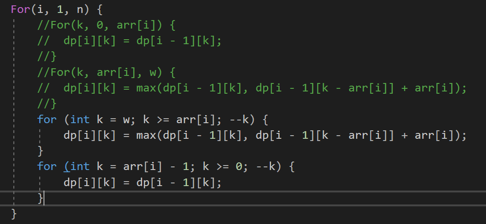
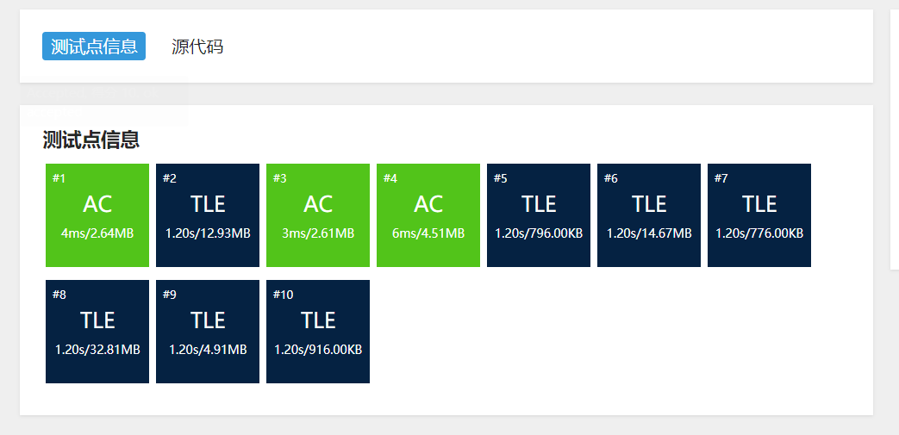
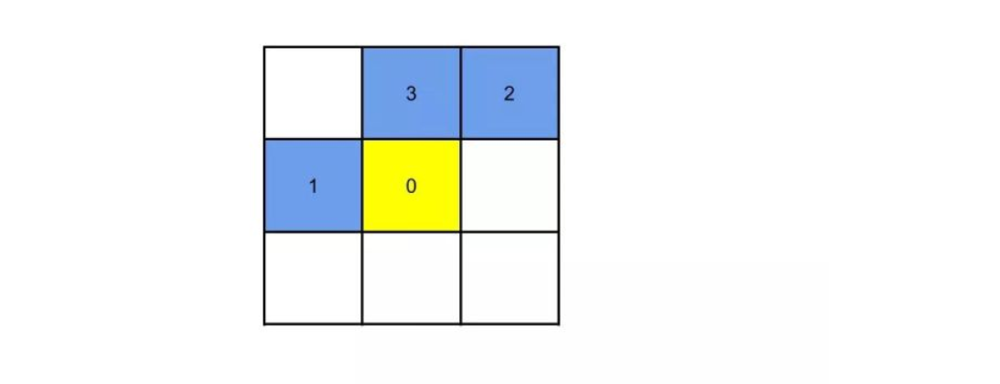

# Daily-Exercise-of-Online-Judge

 My daily exercise of Online Judge.

[TOC]

# 模板

```c++
#include <bits/stdc++.h>
using namespace std;
typedef long long ll;

#define in(x) x=read()
#define For(i, b, e) for(int i = (b); i < (e); ++i)
#define INF 0x7fffff

inline int read() {
	int X = 0, w = 1;
	char ch = getchar();
	while (ch<'0' || ch>'9') { if (ch == '-') w = -1; ch = getchar(); }
	while (ch >= '0' && ch <= '9') X = (X << 3) + (X << 1) + ch - '0', ch = getchar();
	return X * w;
}

int main() {
	
	return 0;
}
```


### 2020-2-19:

DP入门, // 从最怕的开始来吧!

一个很好的例题: 有11, 5, 1面值的硬币, 凑出x最少需要多少枚硬币?

构造函数: 凑出x元最少需要$f(x)$个, **观察如果需要凑15时:** (贪心是不行的)

```c++
11: cost=𝑓(4)+1=4+1=5.
5: cost=𝑓(10)+1=2+1=3.
1: cost=𝑓(14)+1=4+1=5.
    
    𝑓(𝑛)=min⁡{𝑓(𝑛−1),𝑓(𝑛−5),𝑓(𝑛−11)}+1
```

只关心上一状态的所有值(这也是遍历的所有可能的结果). 但并不关心是怎么取到这个值的.

**无后效性**: 如果给定某一阶段的状态, 则在这一阶段以后过程的发展不受这阶段以前各段状态的影响.

**最优子结构**: 大问题的最优解可以由小问题的最优解推出.

以上两个就OK, 回顾`DAG`图上的DP. $f(P)=min⁡{f(R)+w_{(R->P)}}$.

#### DP本质

是枚举所有可能的解, 注意舍弃了一堆不可能成为最优解的答案. 尽可能缩小解空间.

#### 设计DP

表出状态 -> 看目前状态和什么有关 -> 写状态转移方程.

> 一般而言, DP的难点, 在初学时是如何设计状态；在学习深入一些之后, 变成了如何设计转移；在省选/NOI级别, 又变成了如何设计状态。

P1002 过河卒

// 别急啊, 慢慢写, 细致一点!


### 2020-2-20

`lower_bound`会找出序列中第一个**大于等于**x的数

`upper_bound`会找出序列中第一个**大于**x的数

```c++
lower_bound(a + 1, a + 1 + n, x, cmp);
lower_bound(a + 1, a + 1 + n, x, greater <int> () );

返回是一个地址, 需要减数组首地址才是下标:
int p = lower_bound(...) - a;
a[p]就是要找的那个.
```

题解代码:

```c++
#include<iostream>
#include<algorithm>
using namespace std;
const int N=100010;
int a[N],d1[N],d2[N],n;
int main() {
    while(cin>>a[++n]);n--; // 输入
    int len1=1,len2=1;      // 初始长度为1
    d1[1]=a[1];     // 用于求不上升序列长度
    d2[1]=a[1];     // 用于求上升序列长度
    for(int i=2; i<=n; i++) {       // 从a[2]开始枚举每个数(a[1]已经加进去了)
        if(d1[len1]>=a[i])d1[++len1]=a[i];      // 如果满足要求(不上升)就加入d1
        else {      // 否则用a[i]替换d1中的一个数
            int p1=upper_bound(d1+1,d1+1+len1,a[i],greater<int>())-d1;
            d1[p1]=a[i]; 
        }
        if(d2[len2]<a[i])d2[++len2]=a[i];
        else {
            int p2=lower_bound(d2+1,d2+1+len2,a[i])-d2;
            d2[p2]=a[i];
        }
    }
    cout<<len1<<endl<<len2;
    return 0;
}
```

这个更新方式非常特别, 维护一个结果数组(这个结果数组的长度是答案, 但是里面的内容并不是求出来的结果).

如果遇到的这个小于等于结果数组的最后一个, 就增加一并放在后面.

如果遇到的这个大于结果数组最后一个, 就找到结果数组内第一个小于它的数, 并覆盖他. 如果没有则这个数会被丢掉.

> 直观上理解: 考虑一个数列5 2 3 1 4
>
> 首先, 把5加入答案序列中, 然后加2, 发现2<5所以显然2替换5不会使结果更差;
>
> 那么答案序列就是{2}, 然后加3, 发现3>2, 所以直接把3加到答案序列中: {2,3}
>
> 然后加1, 我们发现1<3, 于是我们找到一个最小的但是比1大的数字2, 然后把1替换2, 为什么这么做不会影响结果呢？你可以这么想, 我们当前已经求出了一个当前最优的序列, 如果我们用1替换2, 然后后面来一个数字替换了3, 那么我们就可以得到一个更优的序列, 而如果没有数字替换3, 那么这个1替换2也就是没有贡献的, 不会影响我们结果的最优性。至于, 如何找到一个最小的但是大于某个数字的数字, 弄个二分查找就行了, 因为我们的答案序列是有序的呀。之前讲的lower_bound就是二分查找的过程.

dp的解法, 是$O(n^2)$的. 比较好理解, 就是遍历与记录.


### 2020-2-21

最长公共子序列: 最好化为更简单表示的状态, 比如`dp[i][j]`, 这样可以表示两个串以`i`, 和以`j`结尾的.

如果两个串结尾相同, 那就是`dp[i - 1][j - 1] + 1`, 如果不相同, 就是`dp[i - 1][j], dp[i][j - 1]`的$max$.

注意初始化是**0**.

**$O(nlogn)$算法**: 

思想: 注意其实这题可以转化到**昨天**的最长...序列: 

样例：3 2 1 4 5 我们把他变成 1 2 3 4 5 用一个数组记录一下每个数字变成了什么, 相当于离散化了一下3-1；2-2；1-3；4-4；5-5; 现在我们的第二串1 2 3 4 5 按我们离散化的表示：3 2 1 4 5, 发现满足上升的最长的就是所求;

再来一个例子! **2 4 3 5 1** 和 **1 4 2 3 5**, 对应: 2-1, 4-2, 3-3, 5-4, 1-5; 第二个数组就是: 5, 2, 1, 3, 4.

离散化方法: 相当于先把arr映射到一个只上升的序列, 然后brr映射完就是相当于 **brr在arr上的对应位置**, 比如上面的52134就表示brr的第一个在arr的第五个. 当然这种方法**只适用**于两个数组取值一样并且大于等于0.

```c++
// 题解代码:
#include<cstdio>
#include<algorithm>
#include<cstring>
using namespace std;
const int N=101000;
int b[N],idx[N],n;
int read() {
    int x=0,f=1;char ch=getchar();
    while (ch<'0' || ch>'9'){if (ch=='-')f=-1;ch=getchar();}
    while ('0'<=ch && ch<='9'){x=(x<<3)+(x<<1)+(ch^48);ch=getchar();}
    return x*f;
}
int main() {
    n=read();
    memset(b,0x3f,sizeof(b));
    for (int i=1;i<=n;i++)
        idx[read()]=i;
    for (int i=1;i<=n;i++) {
        int x=idx[read()];
        *lower_bound(b+1,b+n+1,x) = x;
    }
    printf("%d",lower_bound(b+1,b+n+1,b[0])-b-1);
    return 0;
}
```


### 2020-2-22

P1049 装箱问题 01背包:

N件物品和容量为V的背包, 第i件物品装入的收益是$W_i$, 但消耗空间$C_i$. 求解哪些装入可以带来**价值最大**.

状态设计: `f[i][v]`表示前i件商品装入v体积背包.

状态转移方程: 对第i个物体放与不放讨论: `f[i][v] = max(f[i - 1][v], f[i - 1][v - C_i] + W_i)`.

**注意**, 很多状态转移方程都是有在`f[][]`的外面加上一个**值**的. dp过程就是对放东西进背包讨论.

$P1049$ 剩余空间最小, 所以`f[i]`表示第i个物品放入后最小的剩余空间, 注意不妨*把物体重量当做价值.*



注意DP遍历顺序的方式, 还没搞懂, 二维貌似都可以.

```c++
// 传统二维遍历方式:
// 物品编号从1开始.

For(i, 1, 物品个数) {
	For(k, 0, 总容量) {
    	if (k - vol[i] > 0)
            dp[i][k] = max(dp[i - 1][k], dp[i - 1][k - vol[i]] + weight[i]);
        else
            dp[i][k] = dp[i - 1][k];
    }
}
```


### 2020-2-23

将背包问题改成一维的.


## 2020-3-4 P1880 [NOI1995]石子合并

---

重启了.. GG

P1880 [NOI1995]石子合并

暴力的思路: 一圈, **枚举每个空格切一刀**, 变成一条链的问题, 因为任意分法最后肯定存在两包是间接合并的(非相邻合并), 所以可行, 变成一条链之后用记搜? 试一试.

**难点** 似乎在A是从来没合并过的一堆, ~~B 是合并完许多堆之后**获得的分数**, A和B合并后**总得分** A + **2B** . 注意始终维护**区间得分**.~~ GG, 还是要按得分的定义出发去计算. 打一遍前缀和即可.

打区间dp的时候一定要明确是不是闭区间.

## 2020-3-5 P1026 统计单词个数

---

(在卓哥的带领下继续前行 [滑稽]

似乎黄宇老师讲过这题.

状态考虑: 尾巴加一个字母长度变成`n`, 遍历`n-1`种可能, 如果是个单词, 并且开头不是另一个单词, 就OK. $O(n^3)$? 200个问题不大; 状态划分分成进来一个字母作为尾巴, ~~在这个字母前**划分与不划分**, 划分了就加和加上去, 没划分了就继续加?~~ 例如从`i`到`j`, 遍历所有中间的`k`划分, `dp[i][j] = dp[i][k] + (k, j)之间单词个数`. **如何划分递推(前面写的)和如何保证只有`k`个划分**, 似乎是比较困难的两个点.

看题解: 预处理`(i, j)`之间的**要倒着处理,** 因为抓住每个开头只能被一个单词用... 直接find就出来了.

记住, 这里处理**保证只有`k`个划分**, 就是作为状态的一个维度**记录**下来. 上面那个转移方程有冗余, 注意所有开始都是从0开始的. 明确需要的状态维度就是**str结尾, 划分了几次**.

```c++
dp[j][k] = dp[i][k - 1] + num(i, j) // for all i < j.
// dp[j][k] 表示从0~j中有k个划分的最大结果.
```

使用双闭区间还是有好处的, 遍历的时候遍历到`strLen - 1`就可以了.

80? WA了一个点..

## 2020-3-6 P1006 传纸条

---

看了一下卓哥的笔记, 发现自己记得真是太乱了.

> 记忆化搜索一般在不太懂遍历顺序的时候用到. 不要忘了. 动态规划 当前问题 通常是需要在子问题最优解的不同组合之间做**选择**，挑出一组最优的，作为自己的最优解。

##### 题意

矩阵内找两条权值最大的不相交路径. 路径从(0, 0)到(m - 1, n - 1), 输出最大权值和.

##### 想法

**子问题划分**: submatrix, (i, j)表示(0, 0)到此的子矩阵, 问题是到一个点的两条可能是从上面和左边过来的(分别), 如何从两个子矩阵(四条路径)中找出需要的不相交的两条? 我感觉两条要一起搜, 因为**不一定一条是全局最优, 可以保证两条最优**.

没思路, 看题解, GG, **那么两张纸条在过程中就一定在一条斜线上，而在一条斜线上纵坐标与横坐标相加相等。**妙啊:


**用斜线中点代表目前两条线走到的那两端, 注意**, 斜线可以变长, 比如分别走到(1, 3), (3, 1)的时候. 所以比较麻烦的一点是上一层所有可能的斜线都要考虑. 比如上面例子到最后一个点的时候要考虑上一层三种情况的max.

##### 解法

有了在一条斜线的发现, 看成关于 左上右下方向 层次递进的递推. 最优子结构就是每一层的最优. ~~看斜线**中点**, 就是那个点在**除了边界**移动, 最后到最右下的过程, 即中点(i, j):~~ **实际上就是`i + j`相同的为一层, 而且每层更新时 上层只有三种可能! 观察上面红色点即可.**


```c++
// 有点问题...
// 如上图
dp[4, 4] = max{ [4, 2], [3, 3], [2, 4] } 中最大的两个相加(dp) + arr[5, 3] + arr[3, 5]
// 边界条件:
就是边界一条下来这样走的权值和.

// 关心上一层三个就行(斜线中点是边界交点), 关心上一层k * 4个(斜线中点在格子上)
// 干脆边界都加一列
// 这种题目就是二维下标很麻烦, 又有在边界的.
```

尴尬, 写代码发现写不出来.. 因为**比如到了(7, 7)(*作为斜线中点, 而且一定是奇数的时候才有这种问题*), 可能是(9, 5), (5, 9)的, 也可能是(11, 3), (3, 11)的, 这就不太好搞, 因为for loop顺次的顺序被破坏了**. 但是这样有一个规律就是下一层斜线中点一定是**在边界交点**了.

用记搜? 明天试试.

*看了卓哥简洁的记搜, 真的妙, 今天看, 明天打一遍.* 注意记搜递归函数前面返回就是*边界条件*

## 2020-3-7 P1006 传纸条

---

四维dp, 记录最前面的两个位置, 如果不在一个对角线上就return 0, 重复点就return 0.

看成是两个两个点这样走的dfs.

难了:



## 2020-3-8

---

今天福建清零, 出去浪了, GG, 搞得和我过节一样..

明天来补.

## 2020-3-9 01背包, 分组背包

---

今天任务有点重.

#### 小A点菜

状态表示: `dp[i][j]` 是 前i个菜, 花光j元 方法个数. **判断式的状态转移**

```c++
// w[] 是菜价
if j < w[i]:
	// 买不起第i个菜:
	dp[i][j] = dp[i - 1][j]
elif j == w[i]:
	dp[i][j] = dp[i - 1][j] + 1 // 加的1是 用j元都来买第i件菜
elif j > w[i]:
	dp[i][j] = dp[i - 1][j] + dp[i - 1][j - w[i]] // 不买第i件和买第i件 加起来.
```

#### 金明的预算方案

有依赖的背包问题: 背包问题的物品间存在某种“依赖”的关系。也就是说，i依赖于j，表示若选物品i，则必须选物品j。背包九讲 两个解题步骤:

+ 主件-附件方案是$2^n + 1$, 注意但是主件只能被选中一次, 也就是上面这些是**互斥的**. 转化为**分组背包.**
+ $2^n + 1$**太多**, 分组背包一个组有这么多还是GG, 所以**下面来简化::** 对主件i的附件集合进行 **V - c[i]**(c[]是花费) 的01背包, 得到结果`f[0 ~ (V - c[i])]`, `f[]`就是给定花费**能找到的最好附件匹配**. 这样做就相当于**把$2^n + 1$变成了`V - c[i] + 1`**, 为什么? 因为任意给一个k, 在第i个主件组内想要得到最大, 就是`f[k] + w[i]`. k有范围.

有依赖的背包问题 由上面两个步骤, 等价于 n个主件, **n个01背包问题 加 一个分组背包.**

笑了, 我分组背包还不会呢.

##### 分组背包

`f[k][v]`表示前k组物品花费费用v能取得的最大权值

```c++
for 所有的组k:
	for v = V..0:
		for 所有的i 属于 组k:
			f[v] = max{ f[v], f[v - c[i]] + w[i] }
// 注意其中 f[k][v] 表示前k组物品花费费用v能取得的最大权值, 上面做了一维压缩.
// 不选 或者 遍历第k组, 选一个.
// f[k][v] = max{ f[k - 1][v], f[k - 1][v - c[i]] + w[i] | 物品i属于第k组 } 
```

###### P1757 通天之分组背包

模板题.

难了, 发现有个解法

#### ~~金明的预算方案, 非常规解法~~:

是错误的: 遍历所有主件, 先打一个01背包, 在此基础上(同一个for-loop), 打一个选主件和附件的01背包. 遍历所有附件.

#### 01背包小总结:

其实明确了怎么选之后, 就去跑for (int k = N; k >= v[i]... 这个循环(为遍历所有选法设容量限制), 然后更新解, 记住dp数组是 当前已经花了那么多已经花费下的 结果最优.


难了. 还是得打分组背包...

---

### P1156 垃圾陷阱

> 题解提示: 垃圾的高度看成物重，能增加的生命的长短看成价值. 点到为止啊

等价于不考虑**时序**, 把垃圾放在脚下(背包里). 把垃圾放在背包里填满背包, 且让背包里的垃圾能量最少(就是吃掉的能量最多, 维持最多时间). **dp(i, j) 表示前i件充满j容量背包, 容量就是井深度**

~~干脆能量取个负, 变成背包里(不吃的)垃圾的负能量最多.~~ **背包类问题优化min似乎不可能!**

愚蠢了, 并不是类似就一定要局限于01背包的状态转移方程形式.

**思考一波: **

```c++
// dp[i][j] 代表前i件物品 在j高度时 身体的最大血量:
// 就tm两种选择啊! **吃, 不吃:**
// 吃就直接加能量, 不吃就是 从高度是 j - height[i] 转移来的.
dp[i][j] = max { dp[i - 1][j] + energy[i], dp[i - 1][j - height[i]]}
```

~~太难了, 这个转移不对, 前项永远最大.~~

## 2020-3-10

---

#### 再打 P1064 金明的预算方案:

我想了一个很弱智的方法, 但是不可行, 就是**再加上 一个主件和两个附件的选择**即可, 因为他说了最多两个附件.

相当于是遍历了 $2^n + 1$ 种选择, 没有做01背包. 但是WA更多了...


思考一波我似乎做的是 $2^n + 1$ 的01背包, 但是要做 **分组背包**! 似乎只是`for-loop`换一下顺序.

## 2020-3-11

---

#### P1091 合唱队形

打一遍最长上升和下降子序列, 注意**反向(最长下降序列)**是以`a[i]`为**开头** **到结尾**序列的最长下降子序列.

所以最后一个遍历: `maxx = f[i] + f1[i] - 1;` 就可以了.

别忘了最长上升子序列的打法, **只有更高了** 才考虑可不可以接上去, 否则都是1. $O(n^2)$的(不加优化).

自己挖的坑, 跪着也要走完.. 来吧:

#### P1282 多米诺骨牌

这题看着难, 其实感觉很有意思. 一组数, 求对每个取负次数最少使他们的和绝对值最小.

**思考**: 背包的思想, ~~就是n个分组背包, 每组里面有两个且必须并且只能选一个, 比如一块是*6, 1*, 那这个组里就是*5, -5*, 选择最好的方案使总和绝对值最小.~~ 但是需要求最小**翻转次数**. 分组背包似乎有点复杂, 但是肯定要有**第几件的: i, 当前abs(差值): j 两个维度**. 题解这里就说得好, 就是把**abs(差值)**转化成**一组牌中处于上方的牌的和**. 最后再遍历计算最小差值. 这么做和背包的区别就是: **背包是放满一个体积, 这里输出了所有体积的最小优化量(翻转次数 可以是背包问题中的价值最大), 在来最后处理把最适体积(abs最小)的处理出来得到最小优化量**.


难受了.

## 2020-3-12 状压dp

---

### P1896 [SCOI2005]互不侵犯

非常恐怖省选题. 直接看题解了

#### 题目描述

> 在N×N的棋盘里面放K个国王，使他们互不攻击，共有多少种摆放方案。国王能攻击到它上下左右，以及左上左下右上右下八个方向上附近的各一个格子，共8个格子。

显然，目前已使用的国王个数当然必须是状态中的一个部分.

考虑到每行每列之间都有互相的约束关系。因此，我们可以用行和列作为另一个状态的部分, 矩阵状压DP常用**行作为状态**, 就是每行记录下来, **所有行叠起来**作为一个状态.

因为**数据范围小**, 所以用**一个**数字表示一行的状态: 比如 $101_2$ 就是第一个格子有国王，第二个格子没放了国王，第三个格子有放国王, **（注意，格子从左到右的顺序是与二进制从左到右的顺序相反的，因为真正在程序进行处理的时候就像是这样的）**, 这一行的状态就是数字: 5 **十进制的**. 这样好处就是**能很快遍历所有可能状态**. 其实就说得通可以这样结合搜索+位运算.

所以**三个状态**: 第几行（用i表示）、此行放国王的情况是*(二进制)*怎么样的（用j表示）、包括这一行已经使用了的国王数（用s表示）.

状态转移方程目的就是: **上一行所有能够与这一行要使用的状态切合的状态都计入状态统计的加和当中**.

```c++
f[i][j][s] = sum(f[i - 1][k][s - gs[j]]) for all k;
// 其中 gs[j] 是当前行状态是 j 所拥有的国王个数, 就是k二进制表示中1的个数.
```

太难了, 题解预处理太难了.


## 2020-4-27

LCP 03. 机器人大冒险.

后面循环节的步骤有规律, 判断是不是到障碍物或者终点 可以直接减掉最初的, 然后`x, y`会等比例于 循环节的step.

能找规律判断的肯定要写, 暴力遍历大多超时.


## 2020-4-28

**LCP 04. 覆盖**

来了道像样的DP(滑稽), 而且这种似乎是很难的状压DP.

每个格子放不放取决于周围格子, 每个格子两种状态: 0 不放, 1 放. 看一下行列数据不是很大, 大概就是状压了.

**arr[$2^m$]** 表示一行的状态, 开n行: **arr\[n\][$2^m$]**. 这样就维护了一个状态.

遍历所有可能的第一行结果, 接下来所有点都是尽可能优的所有状态(最优子结构) 直到放满, 并记录最佳答案.

**子问题:** arr 当前更新到`i, j`时前面所有的最大可能摆放. 计算每个状态所需时间应是$O(m \times n)$, 就是更新每一个点, 放满所有.

**状态转移:** 假设有最优子结构吧..

+ 如果是坏点, 不能放.
+ 如果上方没有放, 可以竖着放.
+ 如果左边没有放, 可以横着放.
+ 如果上方左边都放了, 就不放.

最主要如何用位运算做这些操作, 这很ICS. 麻烦的是怎么判断左边O不OK.

很麻烦, 搜题解搜到一个: 只记录`3, 2, 1 -> 2, 1, 0`这样的方法, 很牛逼这个方法.



注意关键**从`3, 2, 1 -> 2, 1, 0`的状态转移**, 但是要再给一个维度记录这个 `m` 个的元素的状态到了哪里, 就是我们只关心这`m`个(对下一个元素放什么有用), 还关心这`m`个行进到了那个位置, 因为这`m`个代表的是: **这m个元素及其前面所有 的 最优值**.

> **Notes:**
>
> map, key是一个自定义类型, 比如map<Data, int>, Data需要重载操作符<来实现map:
>
> ```c++
> bool operator<(const Data a) const {
>  if (this->y == a.y)
>      return this->x < a.x;
>  return this->y < a.y;
> }
> ```

上面的思路第一行要初始化, 也就是i遍历$2^m$, 然后把此时`arr[i][1 * n + 0]`对应的 板块个数算出来, 这是很麻烦的.


## 2020-4-29

[LCP 05. 发 LeetCoin](https://leetcode-cn.com/problems/coin-bonus/) 一股浓浓的线段树 树状数组味道..

五一假期有空用树状数组板子打一发吧.

去 [拿硬币](https://leetcode-cn.com/problems/na-ying-bi) 了: (这个dp的分类真是什么都有啊...) 签到题.

去 [传递信息](https://leetcode-cn.com/problems/chuan-di-xin-xi) 了:

刚开始看感觉是DAG上的dp. 但是有个条件就是传递轮数, 这很关键.

看样例 以及条件 有感觉不是DAG(???), 所以dp过程应该是 存着目前路径经历的所有元素? 难点应该在对环的处理.


## 2020-6-25

向阳而生, 逆风飞翔!

##### P1042 乒乓球:

不该犯错误:

+ 没看清题就做, 会带来冗余工作.
+ 某些题目可能需要输出的部分直接认为是不要的.
+ 数组不够大, 要看题目范围.

##### P1563 玩具谜题:

减减减到负数, 负数取模:

```c++
while (cur < 0)
	cur += m;
cur %= m;
```

##### P1601 A+B Problem（高精）:

+ 前面补0, 补到长度相同. 这样后面就不用管一个长一个短了!
+ 完全是用题解的, 代码很简洁, 很不错.

```c++
int compare(string str1, string str2) {
	// 请记住string的compare不能处理长度更长带来的数字更大.
	if (str1.length() > str2.length())
		return 1;
	else if (str1.length() < str2.length())
		return -1;
	else
		return str1.compare(str2);
}
```

##### P4924 [1007]魔法少女小Scarlet:

不该犯的错误:

+ 看清题目样例下标开始结束位置.

+ **矩阵顺时针旋转**: 要搞清楚 临时数组里面 哪一行, 放到目标数组里面哪一列, 遍历(放的)顺序是怎么样的. 这里目标数组和临时数组的下标是**同时前进, 同时遍历转换的.**

  ```c++
  if (direction == 0) {
  	int i = beg, j = aft1 - 1;
	while (i < aft && j >= beg1) {
  		// 现在i指向原来行, j指向目标对换列.
  		for (int k = beg, l = beg1; k < aft && l < aft1; ++k, ++l)
  			arr[k][j] = trr[i][l];
  		++i, --j;
  	}
  }
  ```
  

##### P1328 生活大爆炸版石头剪刀布:

打表打错, 醉了, 这种笨笨的小细节要注意呀!

##### P1518 [USACO2.4]两只塔姆沃斯牛:

代码改了一处地方, 其他相关联的也要改.

##### P2241 统计方形（数据加强版）:

记得开`long long`.

##### P2089 烤鸡:

总和为一个数的全排列, 注意dfs过程传递 `sum, cur`, `tmp`临时答案数组可以为全局变量, 改了`tmp`之后往下继续dfs.

&nbsp;

## 2020-6-26

##### P1618 三连击（升级版）:

并不是所有的这种搜索都要递归, 注意数之间的关系, 遍历一个数即可.

##### P1157 组合的输出:

非常经典的题, 注意记录临时结果的数据完全可以是全局的. 代码比较简洁, 就很舒服:

```c++
void dfs(int tot) {
	if (tot == r) {
		for (int i = 1; i <= r; ++i) {
			cout << setw(3) << used[i];
		}
		cout << endl;
		return;
	}

	Fee(i, used[tot] + 1, n) {
		used[tot + 1] = i;
		dfs(tot + 1);
	}
}
```

##### P1706 全排列问题:

又是经典题, 上面有顺序的就不用回溯, `for` 一路往下就可以, 但是这里全排列不带顺序的就需要一个记录有没有访问过的数组, 然后回溯.

```c++
void dfs(int tot) {
	if (tot == n) {
		Fee(i, 1, n)
			cout << setw(5) << tmp[i];
		cout << endl;
		return;
	}

	Fee(i, 1, n) {
		if (used[i] == 0) {
			used[i] = 1;
			tmp[tot + 1] = i;
			dfs(tot + 1);
			used[i] = 0;
		}
	}
}
```

##### P1088 火星人:

这三题非常不错, 循序渐进, 这题要半路开始`dfs`.

+ 注意: 这里设置dfs起点需要在压栈的`for`里面, 直接把当前需要压栈的那个`i`值设置为起点的值就好.

##### P3392 涂国旗:

前缀和技巧用起来, 认真思考不要慌.

##### P3799 妖梦拼木棒:

看题呀, 这里限制了是四根木棍.

注意观察, 这里组合数是只有取1或者取2的.

不是所有题目都可以不开`long long`过的.

这题最终还是没过, 很无奈, 小数据是OK的, 数据一大就GG, 似乎也没有溢出.

##### P2392 kkksc03考前临时抱佛脚:

就像现在临时抱佛脚..

给一堆数, 找到一个划分使划分后两堆总和最接近. 不要贪心呀, 转化为背包为 $\frac{sum}{2}$ 的尽可能填充这个背包 $\Rightarrow$ 物品容量和价值一样, 尽量填满背包就可以被dp.

注意dp数组是下标是容量, 不要开小了呀. 测评机越界了不一定报错.

##### P1928 外星密码:

这题和CCF某题非常像.

读入过程看成一个流, 在流的中途开始递归.

这题是看题解的, 题解非常好.

##### P1219 [USACO1.5]八皇后:

经典! 注意判断对角线上有没有:

```c++
abs(vis[iFind] - i) == abs(iFind - pos)
```

&nbsp;

## 2020-6-27

##### P1135 奇怪的电梯:

队列记得去重! 某个位置遍历过了就不要再遍历了.

##### P2895 [USACO08FEB]Meteor Shower S:

BFS过程存在路障. 那么就是在BFS过程中看这个点可不可以走.

考虑周全: 这个习惯可还行! 一个地方被先炸了后面就不能更新了.

这题好坑, 好多细节: 1. 先炸后炸的时间, 2. 由上约束带来的零时刻炸的问题.

&nbsp;

## 2020-6-28

##### P1990 覆盖墙壁:

很难想的题目.

+ `F[N]`表示铺满前N*2的面积的墙的方案数.
+ `G[N]`表示铺满前(N+1)*2的面积, 但是第(N+1)列有一个瓷砖已经被铺过的墙的方案数.


